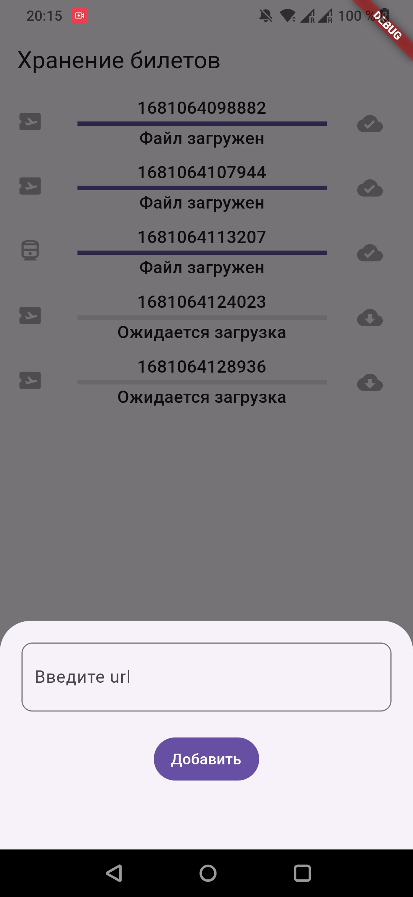
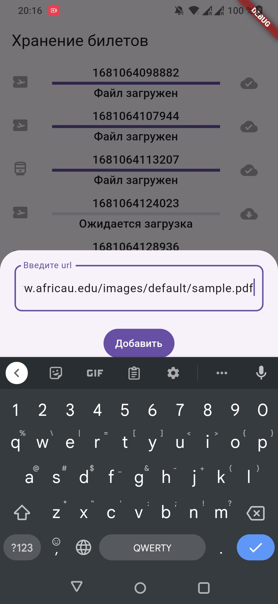
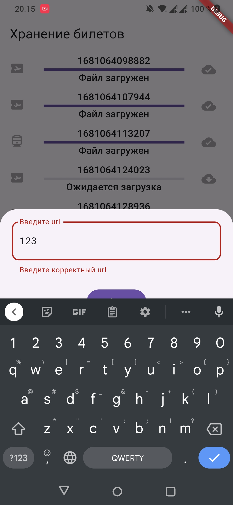

# Целевая платформа

android

# Результаты

Было очень интересно, спасибо! 

### Задание 1

Реализуйте интерфейс экрана: аппбар, состояния экрана, модальное окно (или боттомшит), кнопки, карточку файла.

- Не получилось сделать красиво с showModalBottomSheet, при открытии клавиатуры он поднимался, но почему-то не полностью, долго его мучила.

- Зависла с цветами, первый раз попробовала useMaterial3: true, и долго искала, как в нем красиво поменять цвета у иконок и текста. В итоге заневничала, что не хватит времени, и перешла к следующей задаче.

### Задание 2

Реализуйте логику добавления ссылки на загрузку файла. Не забудьте про валидацию данных!
- Возникли проблемы с регулярными выражениями, перепробовала несколько, потратила много времени:

r'^https?:\/\/[^\s\/]+\/[^\s\/]+\.pdf$'

r'^http(s?)\:\/\/[0-9a-zA-Z]([-.\w]*[0-9a-zA-Z])*(:(0-9)*)*(\/?)([a-zA-Z0-9\-\.\?\,\'\/\\\+&amp;%\$#_]*)?(.pdf)$'

Вот это сработало: r'^https?://(?:[a-z0-9\-]+\.)+[a-z]{2,6}(?:/[^/#?]+)+\.(?:pdf)$'

- Еще не получилось проконтролировать кнопку "Добавить", чтобы она становилась активной только при прохождении валидации

- Не всю логику смогла вынести с экрана в блок

Реализуйте отображение снекбара при успешном добавлении ссылки.
- Это есть

### Задание 3

Реализуйте логику отображения списка файлов.
- Это оказалось самое сложное. Я попробовала убрать логику в блок, но поздно поняла, что не знаю, как контролировать и отдельные виджеты, и страницу, и модалку. Очень хотелось бы научиться такое проектировать.

### Задание 4

Реализуйте процесс загрузки и сохранения файлов. В качестве клиента можно использовать пакет DIO
- Не получилось реализовать UI загрузки. Я пробовала делать emit внутри await. Не уверена, что это рабочая идея.  
- И была ошибка с Hive.

Я не уследила, что у билетов может же быть один и тот же url, поэтому  await _ticketsBox.put(event.ticketModel.url, ticketModel) работал некорректно. Создавал дубль задачи при put, вместо обновления. Ну и так как url у всех одинаковый - обновлял не ну задачу. ##В проекте сейчас эта ошибка.

Хотя, когда я пропробовала сделать обновление по уникальному имени _ticketsBox.put(event.ticketModel.name, ticketModel) тоже некорректно работал. Это не могу объяснить.

И только по индексу всё стало ок await _ticketsBox.putAt(event.index, ticketModel);

- И была опечатка в статусе. ##В проекте сейчас эта ошибка.

- Не дошла до того, чтобы кнопка останавливала загрузку и становилась неактивной после завершения загрузки.

Большое спасибо за задание, хочется попробовать и задания с огонечками сделать)
Немножко обидно, что не попала на утренний созвон, поэтому не знала, что были чатики для участников)

# Ссылки на демонстрацию работы/скриншоты

Вариант с ошибкой. Видео:

Вариант с поправленной ошибкой. Видео:

Скрины

  
  
   
   
  

Screenshot_2023-04-09-20-15-54-65_9164762b2465a9d2b7dd67dd1b6484b4.jpg

[здесь оставьте ссылки на скринкаст/скриншоты, можно в Github-репозитории или в отдельном облаке]
